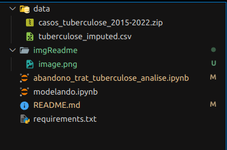
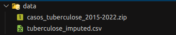

# Classificador de abandono do tratamento da turbeculose

## Visão geral do projeto 
Seja bem vindo ao repositório sobre o classificador de abandono do tratamento da tuberculose.

Este repositório contém arquivos com implementações em python e dados para um projeto sobre a utilização do machine learning com o objetivo de prever o abandono de pacientes no tratamento da tuberculose, no qual foram usados diferentes métodos e técnicas para se chegar ao resultado desejado.

Imagem dos arquivos do projeto:



## Sumário
1. [Banco-dados](#banco-dados)
2. [Instalação](#instalação)
3. [Executar](#executar-projeto)
4. [Contribuição](#contribuição)
5. [Agradecimentos](#agradecimentos)


## Banco Dados
Os bancos de dados podem ser encontrados na pasta **data** com um arquivo zipado com o titulo : *casos_tuberculose_2015-2022* com os dados originais a serem extraidos e, também, um arquivo csv com o nome *tuberculose_imputed* que é o dataset após a imputação de dados faltantes, utilizado na modelagem.



## Instalação

Para executar o projeto é necessário fazer umas instalações importantes antes de tudo (OBS: está sendo usado Ubuntu 22.04).

Primeiramente, é necessário ter os arquivos do programa apenas clonando na pasta que deseja: 

```
git clone https://github.com/intel-comp-saude-ufes/2024-1-P1-TB-treatment-abandonment-classifier.git
```

Instale o python e suas dependencias do projeto que se encontram dentro de requirements.txt: 
```
sudo apt-get install python3-pip
```

Dentro da pasta raiz que o repositório foi clonado insira o seguinte comando: 

```
pip3 install -r requirements.txt
```

Caso o usuário queira usar Jupyter, instale-o através do comando: 
```
pip install notebook
```

## Executar projeto

Para executar o programa, basta executar o comando:

Para ver o Jupyter com a análise dos dados: 
```
jupyter abandono_trat_tuberculose_analise.ipynb
```

Para ver o Jupyter com a modelagem:
```
jupyter modelando.ipynb
```

## Contribuição

Se você achou o projeto útil e interessante, sinta-se à vontade para deixar sua contribuição.

* Crie uma cópia do projeto original na sua conta.
* No GitHub, clique no botão "Fork" no canto superior direito do repositório.
* Use o comando git checkout -b <nome_branch> para criar um novo ramo.
* Adicione suas alterações ao staged com git add ..
* Confirme as alterações usando git commit -m 'add commit'
* Envie suas alterações com git push origin <nome_branch>
* Faça um pull request

## Agradecimentos

Agradecimentos ao professor [André Georghton Cardoso Pacheco](https://github.com/paaatcha) por proporcionar a oportunidade de concretizar este projeto.
